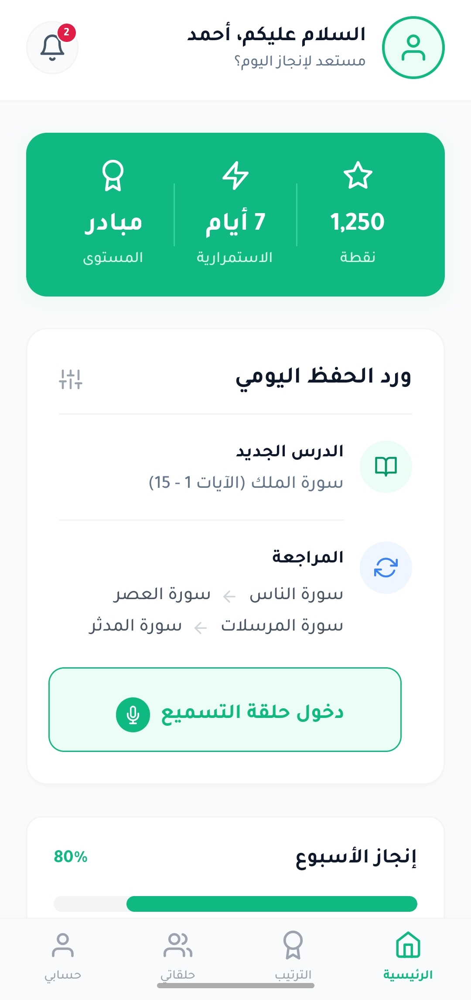
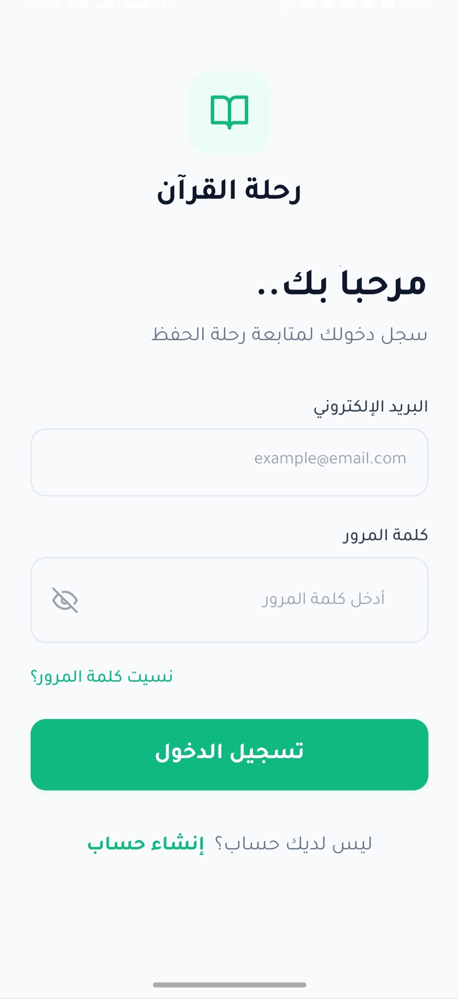
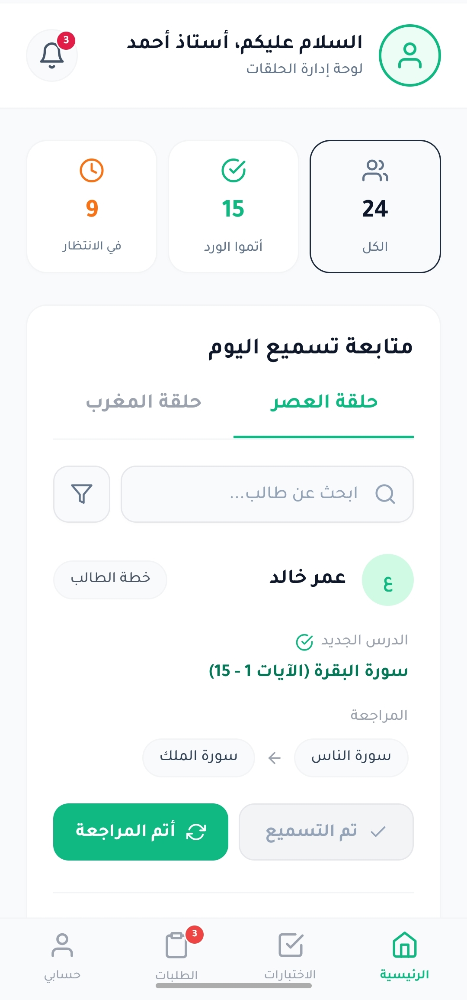
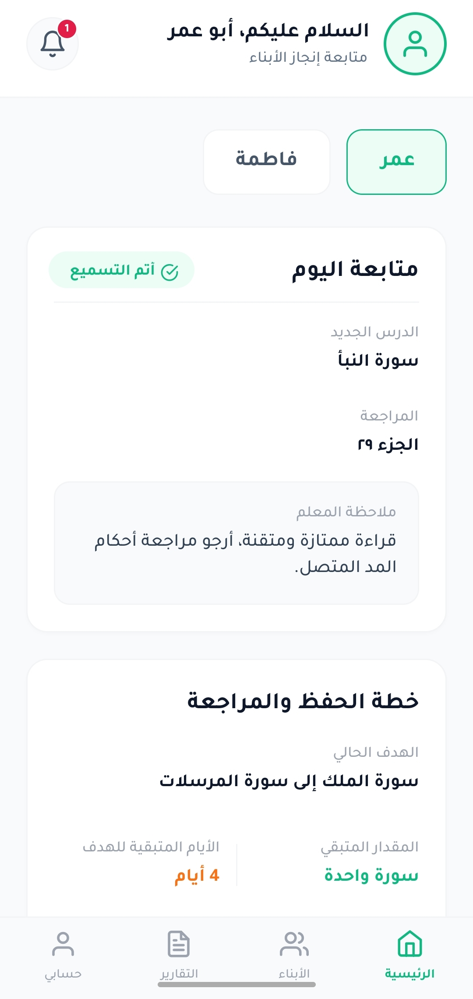
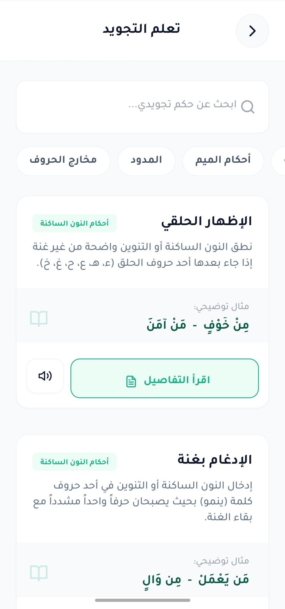
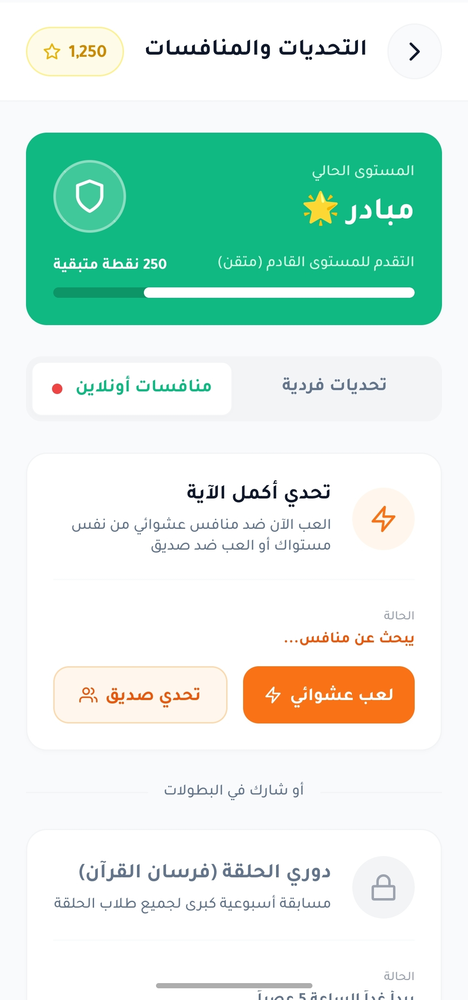

# 📖 Quran Journey App

<p align="center">
  
</p>

Quran Journey is a comprehensive educational mobile application designed to facilitate Quran memorization and learning. Built with React Native and TypeScript, it features a scalable front-end architecture and unified, role-based dashboards tailored for students, teachers, and parents, providing a seamless and interactive educational experience.

## ✨ Features

* **👥 Role-Based Dashboards:** Dedicated interfaces and functionalities for Students, Teachers, and Parents to track progress and manage learning tasks.
* **🗺️ Dynamic Roadmaps:** Customized memorization plans and revision tracking to guide students through their Quranic journey step-by-step.
* **📖 Tajweed Reference Center:** A centralized hub for learning, practicing, and reviewing Tajweed rules interactively.
* **🏆 Interactive Challenges:** Engaging individual tasks and online competitions to motivate students and enhance learning retention.
* **📱 Responsive UI:** A beautifully crafted user interface utilizing modern styling approaches for a smooth, native-like mobile experience.
* **⚙️ Scalable Architecture:** Optimized React Native build processes and a highly structured codebase utilizing TypeScript and JSX.

## 🛠️ Tech Stack

* **Framework:** React Native (Expo)
* **Language:** TypeScript, JavaScript (JSX)
* **Styling:** Tailwind CSS / NativeWind
* **Icons:** Expo Vector Icons 
* **Version Control:** Git & GitHub

## 🎨 System Screenshots

### 🔐 Authentication & Student View
| Login Screen | Student Dashboard |
| :---: | :---: |
|  |  |

### 👨‍🏫 Management Dashboards
| Teacher Dashboard | Parent Dashboard |
| :---: | :---: |
|  |  |

### 🎯 Learning Modules
| Tajweed Center | Online Challenges |
| :---: | :---: |
|  |  |

> **Note:** To see more images, visit the [screenshots folder](screenshots/).

## 🚀 Installation & Setup

1. Clone the repository:
   ```bash
   git clone [https://github.com/anas-roshdi/quran-journey-app.git](https://github.com/anas-roshdi/quran-journey-app.git)
